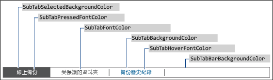

# <a name="change-the-color-scheme-of-the-dashboard-and-launchpad"></a>變更儀表板及啟動列的色彩配置

>適用於：Windows Server 2016 Essentials、 Windows Server 2012 R2 Essentials 中，Windows Server 2012 Essentials

定義想要用於 XML 格式檔案的色彩、在伺服器的資料夾中安裝 .xml 檔案，並在登錄項目中指定 .xml 檔案名稱，就可以變更儀表板及啟動列的色彩配置。  
  
## <a name="create-the-xml-file"></a>建立 XML 檔案  
 下列範例顯示 .xml 檔案的可能內容：  
  
```xml  
<DashboardTheme xmlns="https://www.microsoft.com/HSBS/Dashboard/Branding/2010">  
  
  <!-- Hex color values overwriting default SKU theme colors -->  
  
    <SplashScreenBackgroundColor HexValue="FFFFFFFF"/>  
    <SplashScreenBorderColor HexValue="FF000000"/>  
    <MainHeaderBackgroundColor HexValue="FF414141"/>  
    <MainTabBackgroundColor HexValue="FFFFFFFF"/>  
    <MainTabFontColor HexValue="FF999999"/>  
    <MainTabHoverFontColor HexValue="FF0072BC"/>  
    <MainTabSelectedFontColor HexValue="FF0072BC"/>  
    <MainButtonPressedBackgroundColor HexValue="FF0072BC"/>  
    <MainButtonFontColor HexValue="FFFFFFFF"/>  
    <MainButtonBorderColor HexValue="FF6E6E6E"/>  
    <ScrollButtonBackgroundColor HexValue="FFF0F0F0"/>  
    <ScrollButtonArrowColor HexValue="FF999999"/>  
    <ScrollButtonHoverBackgroundColor HexValue="FF999999"/>  
    <ScrollButtonHoverArrowColor HexValue="FF6E6E6E"/>  
    <ScrollButtonSelectedBackgroundColor HexValue="FF6E6E6E"/>  
    <ScrollButtonSelectedArrowColor HexValue="FFFFFFFF"/>  
    <ScrollButtonDisabledBackgroundColor HexValue="FFF8F8F8"/>  
    <ScrollButtonDisabledArrowColor HexValue="FFCCCCCC"/>  
    <AlertTextBlockBackground HexValue="FFFFFFFF"/>  
    <AlertTextBlockFont HexValue="FF000000"/>  
    <FontColor HexValue="FF000000"/>  
    <SubTabBarBackgroundColor HexValue="FFFFFFFF"/>  
    <SubTabBackgroundColor HexValue="FFFFFFFF"/>  
    <SubTabSelectedBackgroundColor HexValue="FF414141"/>  
    <SubTabBorderColor HexValue="FF787878"/>  
    <SubTabFontColor HexValue="FF787878"/>  
    <SubTabHoverFontColor HexValue="FF0072BC"/>  
    <SubTabPressedFontColor HexValue="FFFFFFFF"/>  
    <ListViewColor HexValue="FFFFFFFF"/>  
    <PageBorderColor HexValue="FF999999"/>      
    <LaunchpadButtonHoverBorderColor HexValue="FF6BA0B4"/>  
    <LaunchpadButtonHoverBackgroundColor HexValue="FF41788F"/>  
    <ClientArrowColor HexValue="FFFFFFFF"/>  
    <ClientGlyphColor HexValue="FFFFFFFF"/>  
    <SplitterColor HexValue="FF83C6E2"/>  
    <HomePageBackColor     HexValue="FFFFFFFF"/>  
    <CategoryNotExpandedBackColor HexValue="FFFFB343"/>  
    <CategoryExpandedBackColor HexValue="FFF26522"/>  
    <CategoryNotExpandedForeColor HexValue="FF2A2A2A"/>  
    <CategoryExpandedForeColor HexValue="FFFFFFFF"/>  
    <HomePageTaskListForeColor    HexValue="FF2A2A2A"/>  
    <HomePageTaskListBackColor HexValue="FFEAEAEA"/>  
    <HomePageTaskListHoverForeColor      HexValue="FF2A2A2A"/>  
    <HomePageTaskListItemBorderColor     HexValue="FF999999"/>  
    <HomePageTaskListSelectedForeColor   HexValue="FFFFFFFF"/>  
    <HomePageTaskListSelectedBackColor   HexValue="FFF26522"/>  
    <HomePageTaskDetailStatusForeColor   HexValue="FFF26522"/>  
    <HomePageTaskDetailDescriptionForeColor     HexValue="FF2A2A2A"/>  
    <HomePageLinkForeColor HexValue="FF0072BC"/>  
    <HomePageLinkSelectedForeColor HexValue="FF0054A6"/>  
    <HomePageLinkHoverForeColor   HexValue="FF0072BC"/>  
    <PropertyFormForeColor HexValue="FF2A2A2A"/>  
    <PropertyFormTabHoverColor HexValue="FF0072BC"/>  
    <PropertyFormTabSelectedColor HexValue="FFFFFFFF"/>  
    <PropertyFormTabSelectedBackColor HexValue="FF414141"/>  
    <TaskPanelBackColor HexValue="FFFFFFFF"/>  
    <TaskPanelItemForeColor HexValue="FF2A2A2A"/>  
    <TaskPanelGroupTitleForeColor HexValue="FF2A2A2A"/>  
    <TaskPanelGroupTitleBackColor HexValue="FFCCCCCC"/>  
    <DashboardClientBackColor HexValue="FF004050"/>  
    <DashboardClientTitleColor HexValue="FFFFFFFF"/>  
    <DashboardClientOptionsForeColor HexValue="FFFFFFFF"/>  
    <DashboardClientOptionsItemForeColor HexValue="FF2A2A2A"/>  
    <DashboardClientHelpForeColor HexValue="FF0054A6"/>  
    <ClientSignInForeColor HexValue="FFFFFFFF"/>  
    <ClientSignInWaterMarkForeColor HexValue="FF999999"/>  
    <ClientSignInUserNameForeColor HexValue="FF2A2A2A"/>  
    <ClientSignInPassWordSpecificBackColor HexValue="FFCCCCCC"/>  
    <ClientSignInButtonBackColor HexValue="FF004050"/>  
    <ClientSignInPassWordForeColor HexValue="FF2A2A2A"/>  
    <LaunchPadBackColor HexValue="FF004050"/>  
    <LaunchPadPageTitleColor HexValue="FFFFFFFF"/>  
    <LaunchPadItemForeColor HexValue="FFFFFFFF"/>  
  <LaunchPadItemHoverColor HexValue="33FFFFFF"/>  
  <LaunchPadItemIconBackgroundColor HexValue="F2004050"/>  
</DashboardTheme >  
  
```  
  
> [!IMPORTANT]
>  xml 元素必須依照上個範例中所列的順序來指定。  
  
> [!NOTE]
>  HexValue 屬性的所有值都是色彩的十六進位值範例。 您可以輸入想要使用的任何十六進位色彩值。  
  
 請使用記事本或 Visual Studio 2010 來建立包含您想要自訂之區域的標籤 .xml 檔案。 此檔案可以有任何名稱，但是副檔名必須是 .xml。 如需可以在儀表板及啟動列上自訂之區域的描述，請參閱[可以變更的儀表板及啟動列區域](Change-the-Color-Scheme-of-the-Dashboard-and-Launchpad.md#BKMK_Dashboard)。  
  
#### <a name="to-install-the-xml-file"></a>若要安裝.xml 檔案  
  
1.  在伺服器上，將滑鼠移至畫面的右上角，然後按一下 **[搜尋]**。  
  
2.  在 [搜尋] 方塊中，輸入 **regedit**，然後按一下 [Regedit]  應用程式。  
  
3.  在左窗格中，依序展開 **HKEY_LOCAL_MACHINE**、 **SOFTWARE**、 **Microsoft**及 **Windows Server**。 如果 **OEM** 機碼不存在，您必須完成下列步驟來建立機碼：  
  
    1.  以滑鼠右鍵按一下 **Windows Server**，指向 **[新增]**，然後按一下 **[機碼]**。  
  
    2.  輸入 **OEM** 作為機碼名稱。  
  
4.  以滑鼠右鍵按一下 **OEM**，指向 **[新增]**，然後按一下 **[字串值]**。  
  
5.  輸入 **CustomColorScheme** 做為字串名稱，然後按 **ENTER**。  
  
6.  在右窗格的 [CustomColorScheme] 上按一下滑鼠右鍵，然後按一下 [修改]。  
  
7.  輸入檔案名稱，然後按一下 **[確定]**。  
  
8.  將檔案複製到 %programFiles%\Windows Server\Bin\OEM。 如果 OEM 目錄不存在，請建立該目錄。  
  
##  <a name="BKMK_Dashboard"></a> 您可以變更的儀表板及啟動列區域  
 本節包含可以自訂的儀表板和啟動列區域的範例。  
  
### <a name="examples"></a>範例  
  
####  <a name="BKMK_Figure1"></a> 圖 1:儀表板的登入頁面  
   
  
####  <a name="BKMK_Figure2"></a> 圖 2:啟動列  
   
  
####  <a name="BKMK_Figure3"></a> 圖 3:啟動列的登入頁面  
   
  
####  <a name="BKMK_Figure4"></a> 圖 4:儀表板文字  
   
  
####  <a name="BKMK_Figure5"></a> 圖 5:子索引標籤框線  
   
  
####  <a name="BKMK_Figure6"></a> 圖 6:工作窗格  
   
  
####  <a name="BKMK_Figure9"></a> 圖 7a:產品啟動顯示畫面  
   
  
#### <a name="figure-7b-home-page"></a>圖 7b：首頁  
   
  
## <a name="see-also"></a>另請參閱  
 [建立和自訂映像](Creating-and-Customizing-the-Image.md)   
 [其他自訂項目](Additional-Customizations.md)   
 [準備用於部署的映像](Preparing-the-Image-for-Deployment.md)   
 [測試客戶經驗](Testing-the-Customer-Experience.md)