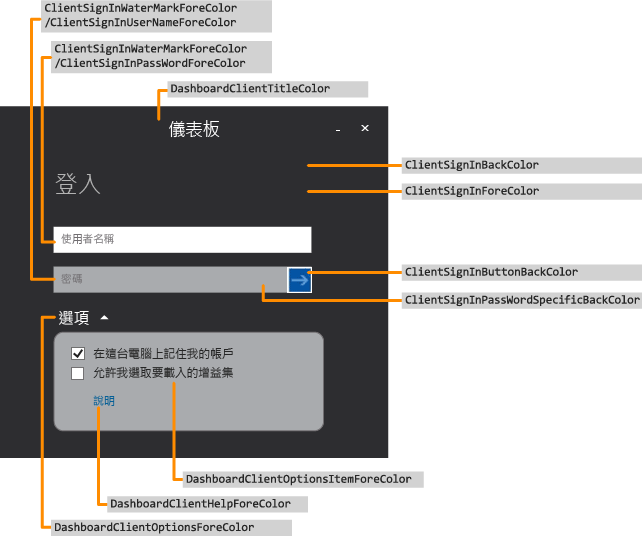
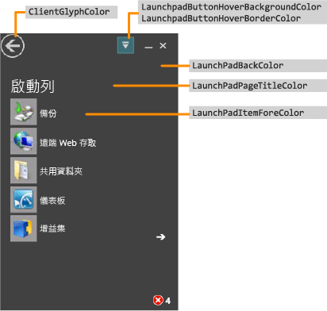
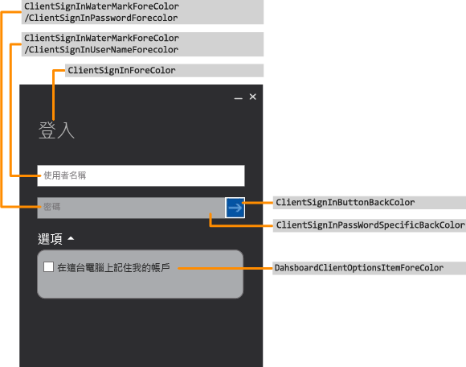
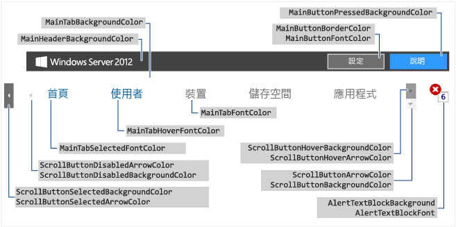
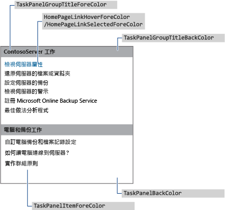
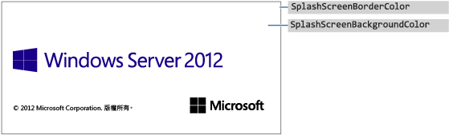
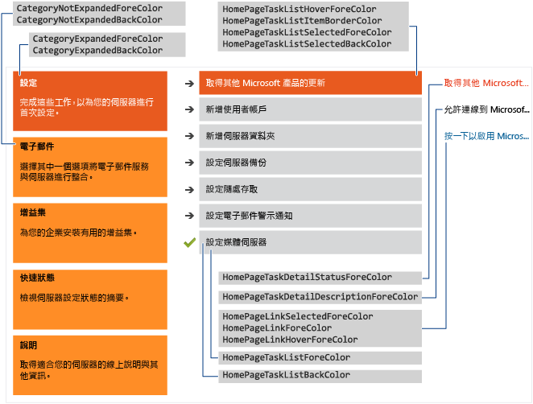

# <a name="change-the-color-scheme-of-the-dashboard-and-launchpad"></a>變更色彩配置 Launchpad 與儀表板

>適用於：Windows Server 2016 Essentials 程式集 Windows Server 2012 R2、Windows Server 2012 程式集

您可以變更色彩配置儀表板，Launchpad 定義您想要使用 XML 色彩格式化檔案、安裝在伺服器上，並登錄項目中指定.xml 檔案名稱的資料夾.xml 檔案。  
  
## <a name="create-the-xml-file"></a>建立 xml 檔案  
 下列範例顯示可能到.xml 檔案：  
  
```xml  
<DashboardTheme xmlns="https://www.microsoft.com/HSBS/Dashboard/Branding/2010">  
  
  <!-- Hex color values overwriting default SKU theme colors -->  
  
    <SplashScreenBackgroundColor HexValue="FFFFFFFF"/>  
    <SplashScreenBorderColor HexValue="FF000000"/>  
    <MainHeaderBackgroundColor HexValue="FF414141"/>  
    <MainTabBackgroundColor HexValue="FFFFFFFF"/>  
    <MainTabFontColor HexValue="FF999999"/>  
    <MainTabHoverFontColor HexValue="FF0072BC"/>  
    <MainTabSelectedFontColor HexValue="FF0072BC"/>  
    <MainButtonPressedBackgroundColor HexValue="FF0072BC"/>  
    <MainButtonFontColor HexValue="FFFFFFFF"/>  
    <MainButtonBorderColor HexValue="FF6E6E6E"/>  
    <ScrollButtonBackgroundColor HexValue="FFF0F0F0"/>  
    <ScrollButtonArrowColor HexValue="FF999999"/>  
    <ScrollButtonHoverBackgroundColor HexValue="FF999999"/>  
    <ScrollButtonHoverArrowColor HexValue="FF6E6E6E"/>  
    <ScrollButtonSelectedBackgroundColor HexValue="FF6E6E6E"/>  
    <ScrollButtonSelectedArrowColor HexValue="FFFFFFFF"/>  
    <ScrollButtonDisabledBackgroundColor HexValue="FFF8F8F8"/>  
    <ScrollButtonDisabledArrowColor HexValue="FFCCCCCC"/>  
    <AlertTextBlockBackground HexValue="FFFFFFFF"/>  
    <AlertTextBlockFont HexValue="FF000000"/>  
    <FontColor HexValue="FF000000"/>  
    <SubTabBarBackgroundColor HexValue="FFFFFFFF"/>  
    <SubTabBackgroundColor HexValue="FFFFFFFF"/>  
    <SubTabSelectedBackgroundColor HexValue="FF414141"/>  
    <SubTabBorderColor HexValue="FF787878"/>  
    <SubTabFontColor HexValue="FF787878"/>  
    <SubTabHoverFontColor HexValue="FF0072BC"/>  
    <SubTabPressedFontColor HexValue="FFFFFFFF"/>  
    <ListViewColor HexValue="FFFFFFFF"/>  
    <PageBorderColor HexValue="FF999999"/>      
    <LaunchpadButtonHoverBorderColor HexValue="FF6BA0B4"/>  
    <LaunchpadButtonHoverBackgroundColor HexValue="FF41788F"/>  
    <ClientArrowColor HexValue="FFFFFFFF"/>  
    <ClientGlyphColor HexValue="FFFFFFFF"/>  
    <SplitterColor HexValue="FF83C6E2"/>  
    <HomePageBackColor     HexValue="FFFFFFFF"/>  
    <CategoryNotExpandedBackColor HexValue="FFFFB343"/>  
    <CategoryExpandedBackColor HexValue="FFF26522"/>  
    <CategoryNotExpandedForeColor HexValue="FF2A2A2A"/>  
    <CategoryExpandedForeColor HexValue="FFFFFFFF"/>  
    <HomePageTaskListForeColor    HexValue="FF2A2A2A"/>  
    <HomePageTaskListBackColor HexValue="FFEAEAEA"/>  
    <HomePageTaskListHoverForeColor      HexValue="FF2A2A2A"/>  
    <HomePageTaskListItemBorderColor     HexValue="FF999999"/>  
    <HomePageTaskListSelectedForeColor   HexValue="FFFFFFFF"/>  
    <HomePageTaskListSelectedBackColor   HexValue="FFF26522"/>  
    <HomePageTaskDetailStatusForeColor   HexValue="FFF26522"/>  
    <HomePageTaskDetailDescriptionForeColor     HexValue="FF2A2A2A"/>  
    <HomePageLinkForeColor HexValue="FF0072BC"/>  
    <HomePageLinkSelectedForeColor HexValue="FF0054A6"/>  
    <HomePageLinkHoverForeColor   HexValue="FF0072BC"/>  
    <PropertyFormForeColor HexValue="FF2A2A2A"/>  
    <PropertyFormTabHoverColor HexValue="FF0072BC"/>  
    <PropertyFormTabSelectedColor HexValue="FFFFFFFF"/>  
    <PropertyFormTabSelectedBackColor HexValue="FF414141"/>  
    <TaskPanelBackColor HexValue="FFFFFFFF"/>  
    <TaskPanelItemForeColor HexValue="FF2A2A2A"/>  
    <TaskPanelGroupTitleForeColor HexValue="FF2A2A2A"/>  
    <TaskPanelGroupTitleBackColor HexValue="FFCCCCCC"/>  
    <DashboardClientBackColor HexValue="FF004050"/>  
    <DashboardClientTitleColor HexValue="FFFFFFFF"/>  
    <DashboardClientOptionsForeColor HexValue="FFFFFFFF"/>  
    <DashboardClientOptionsItemForeColor HexValue="FF2A2A2A"/>  
    <DashboardClientHelpForeColor HexValue="FF0054A6"/>  
    <ClientSignInForeColor HexValue="FFFFFFFF"/>  
    <ClientSignInWaterMarkForeColor HexValue="FF999999"/>  
    <ClientSignInUserNameForeColor HexValue="FF2A2A2A"/>  
    <ClientSignInPassWordSpecificBackColor HexValue="FFCCCCCC"/>  
    <ClientSignInButtonBackColor HexValue="FF004050"/>  
    <ClientSignInPassWordForeColor HexValue="FF2A2A2A"/>  
    <LaunchPadBackColor HexValue="FF004050"/>  
    <LaunchPadPageTitleColor HexValue="FFFFFFFF"/>  
    <LaunchPadItemForeColor HexValue="FFFFFFFF"/>  
  <LaunchPadItemHoverColor HexValue="33FFFFFF"/>  
  <LaunchPadItemIconBackgroundColor HexValue="F2004050"/>  
</DashboardTheme >  
  
```  
  
> [!IMPORTANT]
>  必須指定 xml 項目順序列在前一個範例。  
  
> [!NOTE]
>  所有的 HexValue 屬性的值為色彩十六進位值的範例。 您可以輸入您想要使用的任何十六進位的色彩值。  
  
 使用「記事本」或 Visual Studio 2010 建立.xml 檔案，包含您想要自訂所負責領域有關的標籤。 將檔案可以提供任何名稱，但必須.xml 擴充功能。 描述儀表板上 Launchpad 可自訂的區域，請查看[儀表板及 Launchpad 的區可變更的](Change-the-Color-Scheme-of-the-Dashboard-and-Launchpad.md#BKMK_Dashboard)。  
  
#### <a name="to-install-the-xml-file"></a>若要安裝之.xml 檔案  
  
1.  在伺服器上，將滑鼠移到畫面的右上角，然後按一下**搜尋**。  
  
2.  在搜尋方塊中，輸入**regedit**，然後按**Regedit**應用程式。  
  
3.  在左窗格中，展開**跳**，展開 [**軟體**，展開 [ **Microsoft**，展開 [ **Windows Server**。 如果**OEM**鍵並不存在，您必須先完成下列步驟來建立：  
  
    1.  以滑鼠右鍵按一下**Windows Server**，指向 [**新**，然後按一下 [**鍵**。  
  
    2.  輸入**OEM**鍵的名稱。  
  
4.  以滑鼠右鍵按一下**OEM**，指向 [**新**，然後按一下 [**字串值**。  
  
5.  輸入**CustomColorScheme**字串，然後按下的名稱為**輸入**。  
  
6.  以滑鼠右鍵按一下**CustomColorScheme**中右窗格中，然後按**修改]**。  
  
7.  輸入檔案名稱，然後按一下**[確定]**。  
  
8.  將檔案複製到 %programFiles%\Windows Server\Bin\OEM。 如果 OEM directory 不存在，建立它。  
  
##  <a name="BKMK_Dashboard"></a>儀表板及 Launchpad 區可變更  
 本節儀表板及 Launchpad 區域可自訂的範例。  
  
### <a name="examples"></a>範例  
  
####  <a name="BKMK_Figure1"></a>圖 1：登入頁面的儀表板  
   
  
####  <a name="BKMK_Figure2"></a>圖 2 所示：Launchpad  
   
  
####  <a name="BKMK_Figure3"></a>圖 3 所示：登入 Launchpad 的頁面  
   
  
####  <a name="BKMK_Figure4"></a>圖 4：儀表板文字  
   
  
####  <a name="BKMK_Figure5"></a>圖 5 所示：子標籤邊境  
 ![Windows SBS 儀表板子] 索引標籤邊境](media/SBS8_ADK_DashboardSubtabborder.png "SBS8_ADK_DashboardSubtabborder")  
  
####  <a name="BKMK_Figure6"></a>圖 6：窗格  
   
  
####  <a name="BKMK_Figure9"></a>圖 7a: Product 畫面  
   
  
#### <a name="figure-7b-home-page"></a>圖 7b：首頁  
   
  
## <a name="see-also"></a>也了  
 [建立和自訂映像](Creating-and-Customizing-the-Image.md)   
 [其他的自訂項目](Additional-Customizations.md)   
 [準備部署映像](Preparing-the-Image-for-Deployment.md)   
 [測試客戶體驗](Testing-the-Customer-Experience.md)